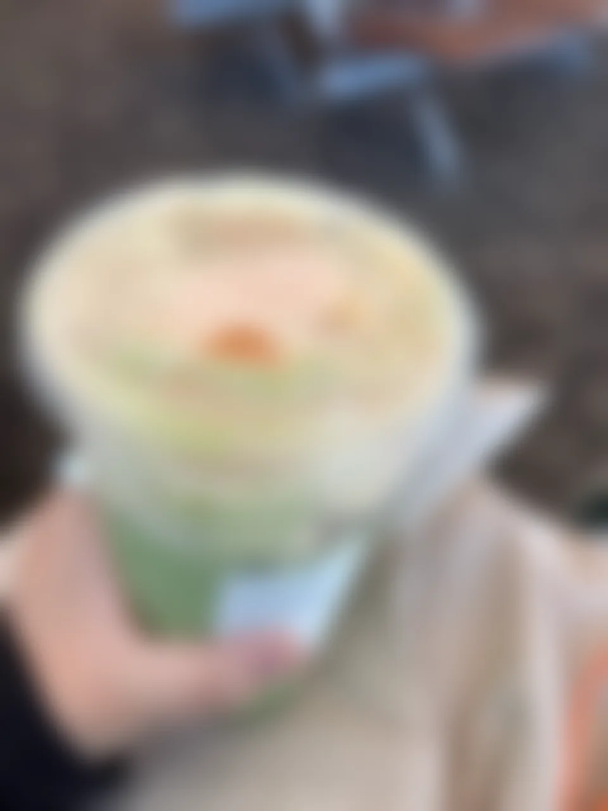
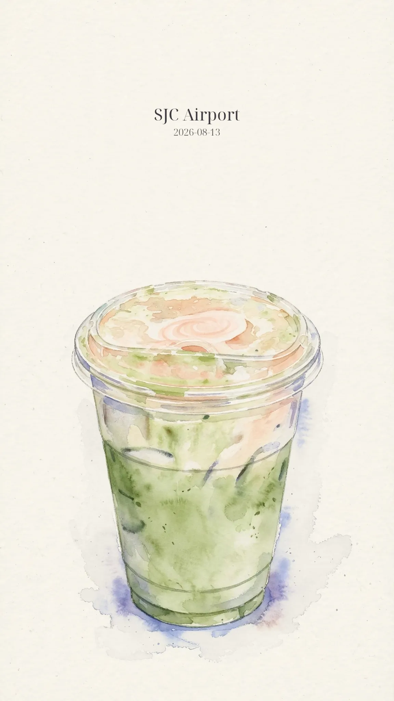
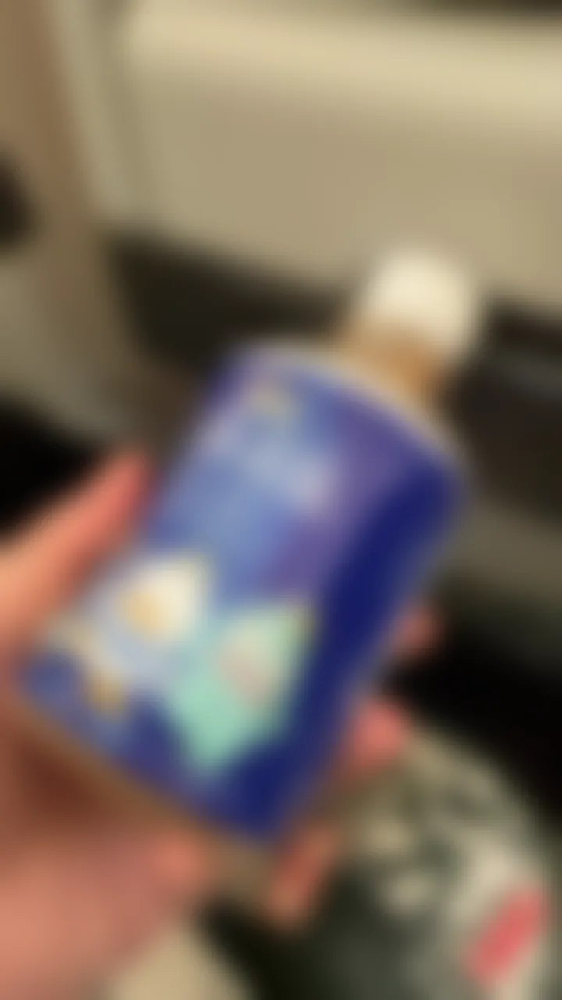
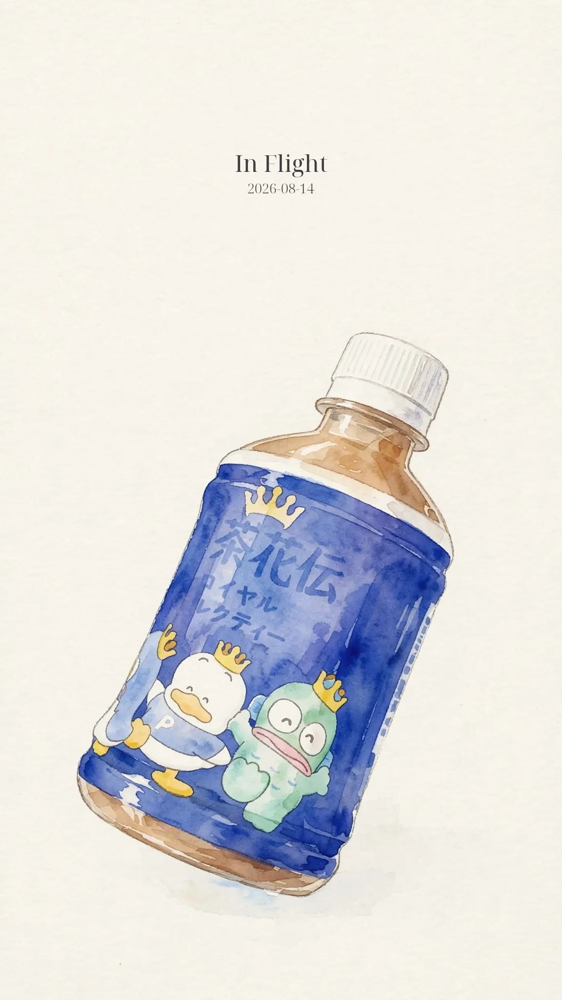
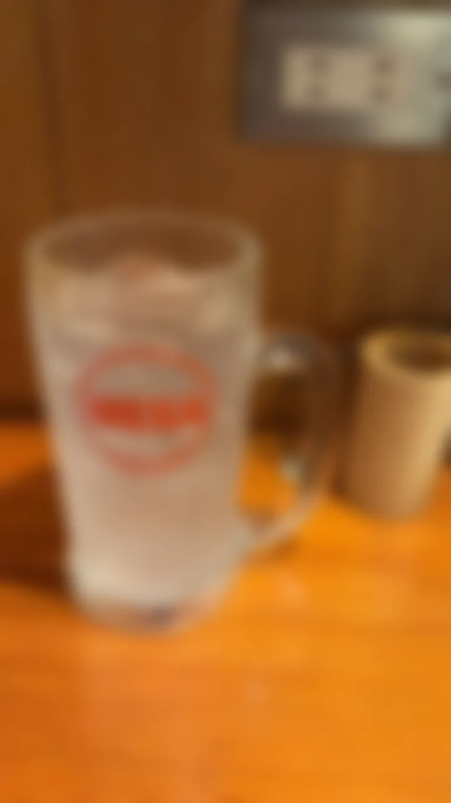
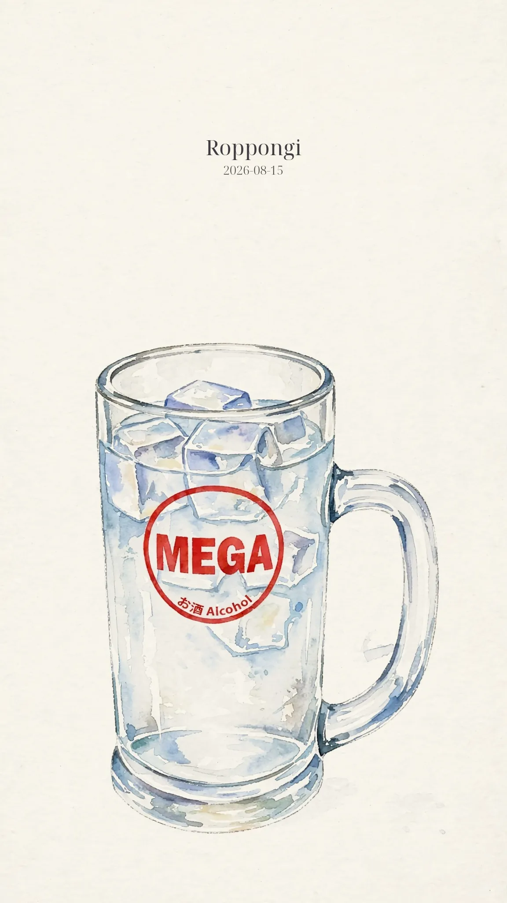

# Photo Imprint (印痕)

> Keep the photo, remember it in a different stroke. 留住那张照片，只换一种笔触去记。

[English](README.md) | [中文](README.zh-CN.md)

Photo Imprint keeps that photo — silhouette, proportions, cap, logo — and only changes the stroke you remember it with. Real travel photos → a consistent 9:16 watercolor journal carousel for IG / Xiaohongshu.

`locoda/photo-imprint-skill` · English skill, Chinese name 印痕

## See what it does

Direct prompting makes a pretty picture that forgets your photo. Photo Imprint locks what matters and only abstracts the brushwork.

| Source photo (blurred for privacy) | Photo Imprint (Template B – drink-minimal-caption-above) |
|---|---|
|  |  |
| SJC Airport – small cup, green drink, clear lid (source blurred 12px) | Same cup, same lid, same proportion. 50% paper white, caption `SJC Airport` at y=300 / y=367, diffusion ≤10% width, 2–3 edge bleeds only |
|  |  |
| In-flight cup in hand (source blurred) | Cup locked, cabin simplified to cool wash, no invented skyline |
|  |  |
| Roppongi street cup (source blurred) | Cup locked, background strongly simplified, no Tokyo Tower invented |

All samples are locally compressed to webp <100KB (`assets/samples/`). Source photos are blurred 12px for privacy. Full 1152×2048 finals are 399–430KB jpg, no EXIF.

Template A (travel-scene-caption-below) is the same idea — image lower, caption below — for open scenes. Share 2–3 scene photos and I will add a Template A example in the same folder.

## Install and use

```bash
npx skills add locoda/photo-imprint-skill
# or
git clone https://github.com/locoda/photo-imprint-skill.git
pip install -r requirements.txt
python3 bin/check_environment.py
```

3 steps:

```bash
# 1. EXIF order + manifest
python3 bin/preprocess.py --input /path/to/photos --output work/manifest.json --config work/resolved-config.json

# 2. Plan + sample only
python3 bin/build_production_plan.py --render-plan work/render-plan.json --output work/production-plan.md
# render page 1, discuss plan+sample together

# 3. After explicit approval → batch → QA → ZIP
python3 bin/package_verified.py package --input work/final --output dist/carousel.zip
```

`workflow.py status` / `next` never writes, it only tells you what to do next.

## How it works

Not a prompt collection. A gated workflow that keeps 5 concerns independent — so the stroke changes, the photo stays:

1. **Theme** – what to draw (source photo is authority)
2. **Style** – how to draw it (wash, edge, value from a reference, never its subject)
3. **Layers** – what stays separate (plate / paper / typography)
4. **Composition** – where it goes (deterministic 9:16, 1152×2048, paper `rgb(247,244,235)`)
5. **Unification** – how the set stays one (same brightness, grain, caption y=300/367)

Principle:

```
photos → EXIF order → per-page brief (preserve / simplify / omit) → production-plan.md
      → render page 1 only → hash-lock sample style contract
      → discuss plan+sample → explicit approval
      → batch 2..N with frozen contract → clean-plate normalization
      → deterministic composition → two-level QA → verified ZIP (no EXIF/GPS/XMP)
```

Shape-lock is why it keeps the photo: Template B locks cup/bottle silhouette, proportions, cap/lid, logo position; abstraction only in brushwork, with 2–3 ultra-light edge bleeds ≤10% width right / ≤8% height bottom, colors sampled from subject itself.

Typed revisions (`remove`, `retain_but_simplify`, `add_as_secondary`, `preserve_unchanged`) keep “the roads feel strange” from becoming “delete every road”.

## 2 layout templates

**Template A `travel-scene-caption-below`** – image lower (center 58–62%, scale 38–45%), caption below, ~50% negative space top/sides.

**Template B `drink-minimal-caption-above`** – caption above at y=300/367, subject centered 60–65% (scale 32–40%, small cup stays small), same 50% paper, restrained diffusion. Current 3-page set uses this.

Full fields: canvas, paper, placement, typography (`NotoSerifDisplay-Regular 48pt / Light 27pt`, `#403C44`), diffusion limits, forbidden elements.

## vs naive prompting

| Naive | Photo Imprint |
|---|---|
| One prompt for all | Per-page brief + frozen style contract |
| Invents background | Forbidden-inventions list enforced |
| Small cup → big cup | Shape-lock, small stays small |
| 3 pages 3 papers | Unified warm white, same grain/brightness |
| No review | Page-level compliance + set-level cohesion |

## Project layout

```
SKILL.md                  # workflow (English)
presets/travel-food-journal.json
profiles/{themes,styles,layers,compositions,unification}/
assets/samples/           # before/after (webp <100KB)
assets/style-packs/       # Smithsonian public-domain packs
tests/                    # 34 gate/regression checks
```

Private references stay local and are never sent externally without explicit consent.

## Validation

```bash
python3 -m unittest discover -s tests -v
python3 bin/validate_skill.py --json
```
