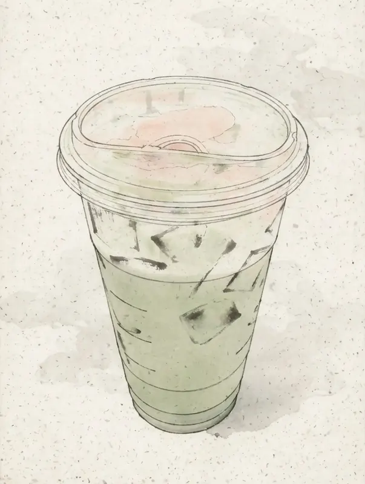
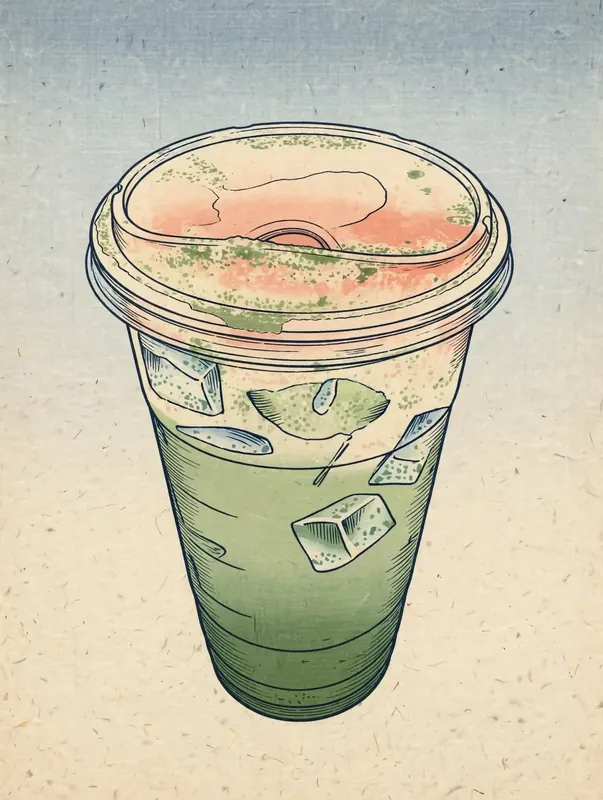
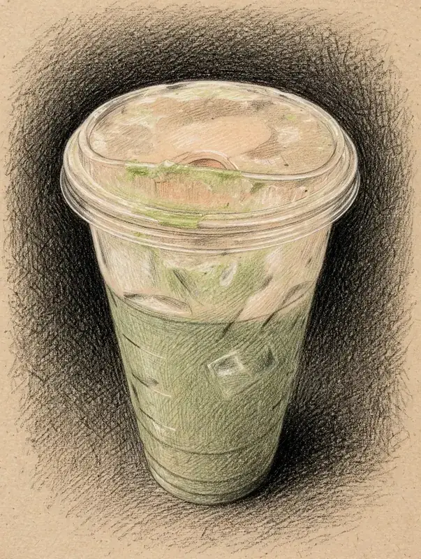

# Photo Imprint (印痕)

> 留住那张照片，只换一种笔触去记。Keep the photo, remember it in a different stroke.

[English](README.md) | [中文](README.zh-CN.md)


留住那张照片是谁，只把笔触换成手绘。真实旅行照 → 一套风格统一的手帐轮播，发小红书 / IG 用。

`locoda/photo-imprint-skill` · 英文 skill，中文名印痕

## 能做什么

直接用 prompt 渲，好看但会忘掉你的照片。印痕把轮廓、比例、盖子、logo 位置锁住，只在笔触上抽象。

| Photo Imprint（Template B – drink-minimal-caption-above） | 原片（已模糊处理，保护隐私） |
|---|---|
|  |  |
| 同一个杯、同一个盖、同样比例。50% 留白，caption 在 y=300/367，扩散只在贴边 2-3 处，≤10% 宽度 | SJC Airport – 小杯、绿饮、透明盖（原片 12px 模糊） |
|  |  |
| 杯型锁定，机舱简化成冷色块，不编造天空 | 飞机上端杯（原片已模糊） |
|  |  |
| 杯型锁定，背景强简化，不编造东京塔 | 六本木街头杯（原片已模糊） |

所有样张已本地压缩成 webp <100KB，放在 `assets/samples/`，原片 12px 模糊保护隐私。完整 1152×2048 终版 jpg 399–430KB，无 EXIF。

Template A（travel-scene-caption-below，图在下字在下）同理，给 2-3 张开阔场景照就能补一个例子。


## 风格任选 — 同一杯，换笔触

风格只改怎么画，不改画什么。选一种，全程锁死。同一个星巴克杯，三种 Artvee 笔触：

| `sumi-e-ink` 芝田浙信 1847 | `hiroshige-bokashi` 广重 1833 去雨版 | `seurat-conte` 修拉 1882 |
|---|---|---|
|  |  |  |
| 疏朗墨线、淡墨阴影、大留白 | 平涂 + bokashi 渐变，无斜雨线，前景木版化 | 无硬轮廓、绒面 Conté 排线、明暗塑形 |

**已打包、可直接用（5个）：**

- `blue-lavender-watercolor` — 透明水洗，冷蓝/薰衣草明度分组，纸白呼吸（Smithsonian / Allen Tucker）—— 见上 3 张样张
- `highway-485-lithograph` — 稀疏断续轮廓，纸白留白，克制重色点缀（Smithsonian / Allen Tucker）
- `sumi-e-ink` — 芝田浙信《茶壶与杯子》1847：疏朗墨线、淡墨阴影、大留白
- `hiroshige-bokashi` — 歌川广重《庄野白雨》1833 去雨版：平涂 + bokashi 渐变，无斜雨线，前景木版化
- `seurat-conte` — 修拉《修拉母亲》1882–83：无硬轮廓，绒面 Conté 排线，明暗塑形

**仅文本规则（待补参考图）：** `botanical-watercolor`、`paper-collage`、`watercolor-journal` —— 可用，会提示待补。

在 `profiles/styles/<id>.json` 里切风格。一套轮播只用一种笔触，EXIF 顺序和 caption 锁死，不编 logo/文字，不带手/布。


## 怎么用

```bash
npx skills add locoda/photo-imprint-skill
# 或
git clone https://github.com/locoda/photo-imprint-skill.git
pip install -r requirements.txt
python3 bin/check_environment.py
```

3 步：

```bash
# 1. EXIF 排序 + manifest
python3 bin/preprocess.py --input /path/to/photos --output work/manifest.json --config work/resolved-config.json

# 2. Plan + 只渲第1页
python3 bin/build_production_plan.py --render-plan work/render-plan.json --output work/production-plan.md
# 渲第1页，和 plan 一起讨论

# 3. 明确批准后 → batch → QA → ZIP
python3 bin/package_verified.py package --input work/final --output dist/carousel.zip
```

`workflow.py status` / `next` 只读不写，告诉你下一步。

## 原理是怎么做的

不是 prompt 合集，是带门禁的生产流。笔触换了，照片还在，靠 5 个维度拆开独立控制：

1. **Theme** – 画什么（原片是权威）
2. **Style** – 怎么画（水洗、边缘、明度分组来自参考图，不带它的主体）
3. **Layers** – 什么必须分层（plate / 纸 / 文字）
4. **Composition** – 放哪（确定性合成，纸色 `rgb(247,244,235)`，默认可调）
5. **Unification** – 怎么统一（同亮度、同颗粒、同 caption）

流程：

```
photos → EXIF 排序 → 每页 production_brief（保留/简化/省略）→ production-plan.md
      → 只渲第1页 → 冻结 sample style contract
      → 讨论 plan+sample → 明确批准（原话）
      → batch 2..N 用冻结 contract → 洗版（profile-driven）
      → 确定性合成 → 双层 QA → 已验证 ZIP（无 EXIF/GPS/XMP）
```

为什么能留住那张照片：Template B 锁定杯/瓶轮廓、比例、盖子、logo 位置，抽象只在笔触和边缘，扩散克制 2-3 处贴边溶色，颜色取自主图。

批准后改动用四种操作（`remove` / `retain_but_simplify` / `add_as_secondary` / `preserve_unchanged`），避免“路有点怪”被误读成“把路全删了”。

## 两套布局模板

**Template A `travel-scene-caption-below`** – 图偏下，caption 在图下方，约 50% 留白。

**Template B `drink-minimal-caption-above`** – caption 在上方，主体居中偏下，小杯保持小，同留白，扩散克制。当前三张就用这个。

完整字段见 `production-plan.md`。

## 和直接 prompt 的区别

| 直接 prompt | Photo Imprint |
|---|---|
| 一套 prompt 渲所有页 | 每页 brief + 冻结 style contract |
| 编造背景/地标 | forbidden-inventions 列表挡住 |
| 小杯变大杯 | shape-lock，小杯保持小 |
| 三页三种纸 | 统一暖白，同亮度同颗粒 |
| 无复核 | 页级合规 + 组级统一 |


## 目录

```
SKILL.md                  # 工作流（英文）
presets/travel-food-journal.json
profiles/{themes,styles,layers,compositions,unification}/
assets/samples/           # 压缩后的前后对比（webp <100KB）
assets/style-packs/       # 自带 Smithsonian 公开域风格包
tests/                    # 34 个门禁/回归测试
```

私有参考图只存本地，未经明确授权不外发。

## 验证

```bash
python3 -m unittest discover -s tests -v
python3 bin/validate_skill.py --json
```


---

Made by [1mether](https://1mether.me).

*留住那张照片，只换一种笔触去记。*

